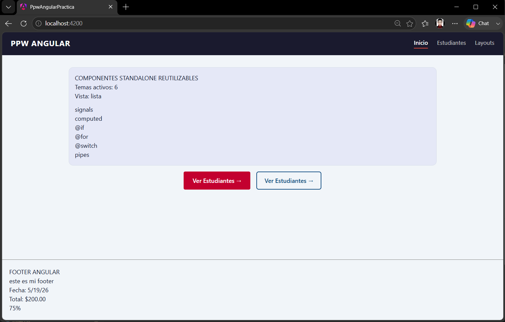
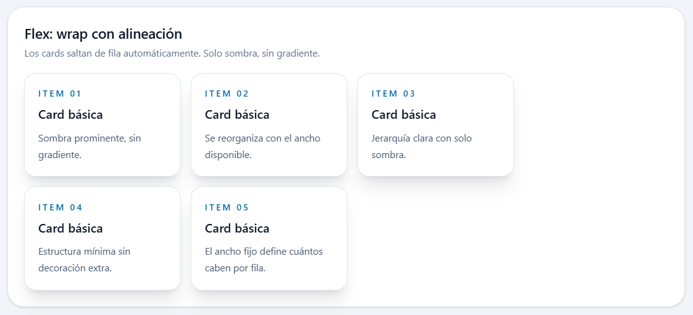
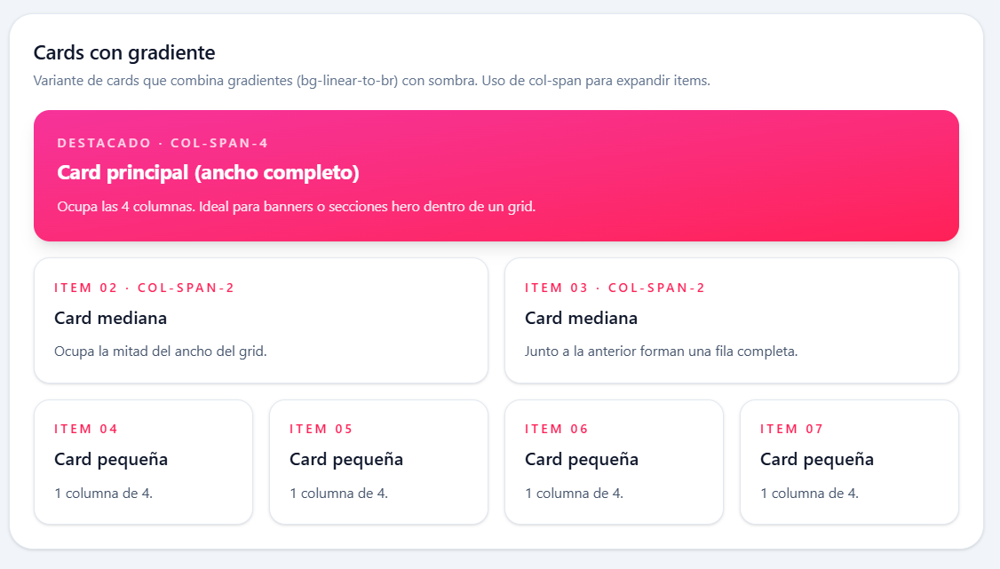
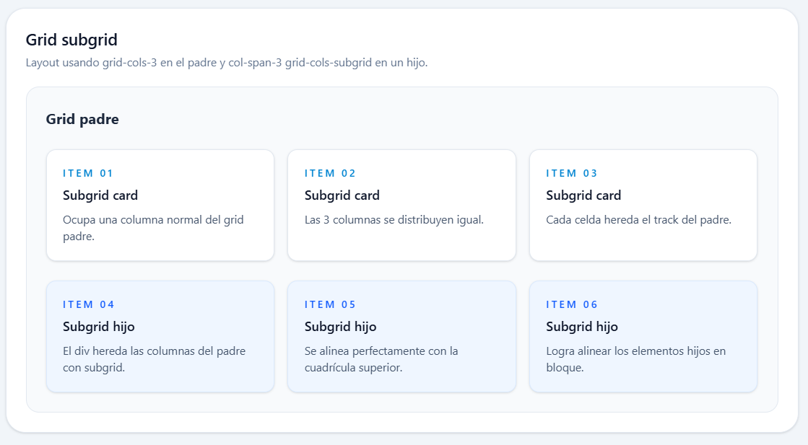
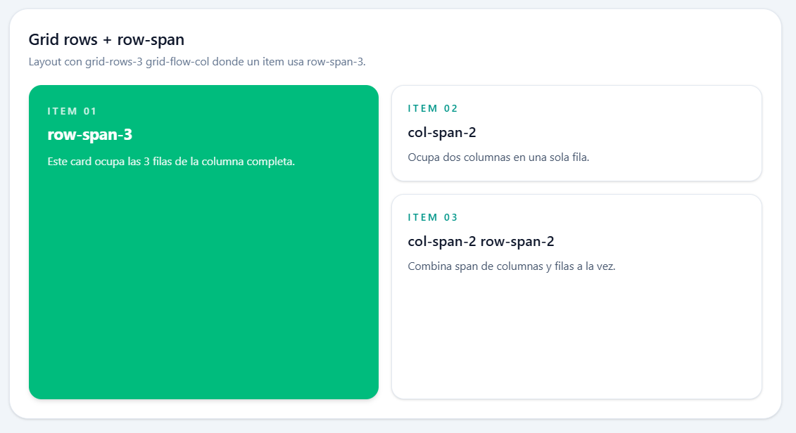
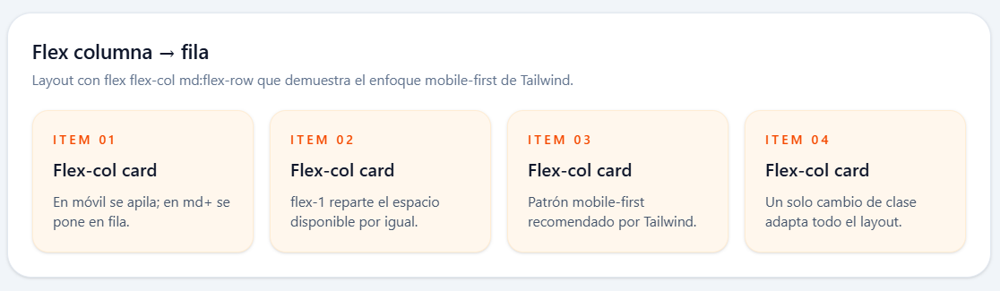

# Práctica 04: Estilos y Layout con Tailwind

## 📌 Información General

- **Título:** Estilos y Layout con Tailwind
- **Asignatura:** Programación y Plataformas Web
- **Carrera:** Ingeniería en Computación
- **Estudiante:** Carlos Antonio Gordillo Tenemaza
- **Semestre:** 5to Semestre
---

## 🛠️ Descripción

Este proyecto demuestra la refactorización de una aplicación web construida en Angular 21, migrando de CSS tradicional (archivos independientes por componente) a un enfoque de diseño atómico utilizando **TailwindCSS**. 

El proyecto elimina las clases CSS globales y aplica utilidades directamente en las plantillas HTML para manejar colores de marca, tipografía, espacios y diseño responsivo. Además, se incluye una nueva sección dedicada exclusivamente a explorar arquitecturas avanzadas de diseño web utilizando **CSS Grid** y **Flexbox** para la construcción de interfaces modernas y escalables.

---

## 💻 Fragmentos de Código Destacado

### 1. Configuración de Tokens de Marca (Tailwind Global)
```css
@import "tailwindcss";

@theme {
  --color-brand: #0f4c81;
  --color-brand-strong: #0a3356;
}

@layer base {
  body {
    @apply bg-slate-100 text-slate-900 antialiased;
  }
}
```

### 2. Refactorización del Shell Principal (`App Component`)
```html
<div class="flex min-h-screen flex-col bg-slate-100">
  <app-header />
  <main class="flex-1 mx-auto w-full max-w-5xl px-6 py-8">
    <router-outlet />
  </main>
  <app-footer />
</div>
```

### 3. Layout: Grid con Subgrid
```html
<div class="grid grid-cols-1 md:grid-cols-3 gap-4">
  <h3 class="col-span-1 md:col-span-3 text-lg font-bold">Grid padre</h3>
  <div class="col-span-1 md:col-span-3 grid grid-cols-1 md:grid-cols-subgrid gap-4 mt-2">
    </div>
</div>
```

### 4. Layout: Flexbox con Carrusel (Desplazamiento Horizontal)
```html
<div class="flex gap-4 overflow-x-auto pb-2">
  <article class="min-w-[16rem] shrink-0 rounded-2xl bg-linear-to-br from-sky-400 to-blue-600 p-5 shadow-md">
     </article>
</div>
```


---

## 🧑‍💻 Capturas de Pantalla

### 1. Aplicación Refactorizada Base
**Descripción:** Interfaz de las páginas HomePage y StudentsPage adaptadas 100% con utilidades de Tailwind. Se evidencia la desaparición de los archivos .css y la aplicación de tokens de marca, sombras y ritmo vertical.




### 2. Card básica con sombra
**Descripción:** Layout base usando shadow-xl y ring-1 ring-slate-200. Las cards tienen ancho fijo (w-56) y se reorganizan automáticamente según el espacio disponible. Es la estructura mínima: sin gradiente, solo sombra prominente para generar jerarquía visual.



### 3. Cards con gradiente
**Descripción:** Variante de cards que combina gradientes (bg-linear-to-br) con sombra. El gradiente añade profundidad visual sin necesidad de bordes ni imágenes. Se usa from-* y to-* para definir los colores de inicio y fin del degradado.



### 4. Grid subgrid
**Descripción:** Layout usando grid-cols-3 en el padre y col-span-3 grid-cols-subgrid en un hijo. La segunda fila hereda los tracks de columnas del padre gracias a subgrid, logrando que los items hijos se alineen perfectamente con la cuadrícula superior sin necesidad de definir nuevas columnas.



### 5. Grid rows + row-span
**Descripción:** Layout con grid-rows-3 grid-flow-col donde un item usa row-span-3 para ocupar toda la altura de la columna. Los demás items combinan col-span-2 y row-span-2 para crear una distribución asimétrica que genera jerarquía visual sin CSS adicional.



### 6. Flex columna → fila
**Descripción:** Layout con flex flex-col md:flex-row que demuestra el enfoque mobile-first de Tailwind. En pantallas pequeñas los items se apilan verticalmente; en pantallas medianas (md:) se distribuyen en fila horizontal. Cada item usa flex-1 para repartir el espacio disponible de forma equitativa.


