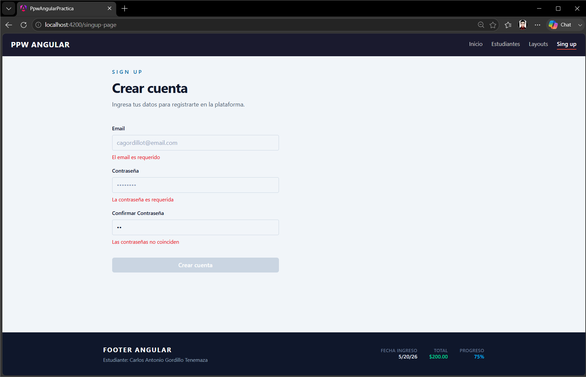
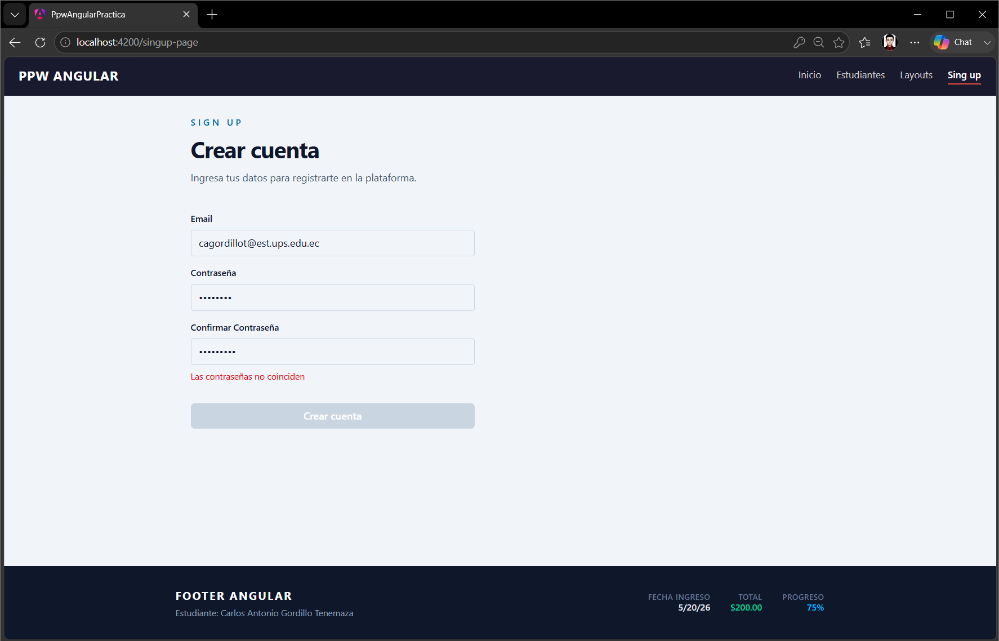
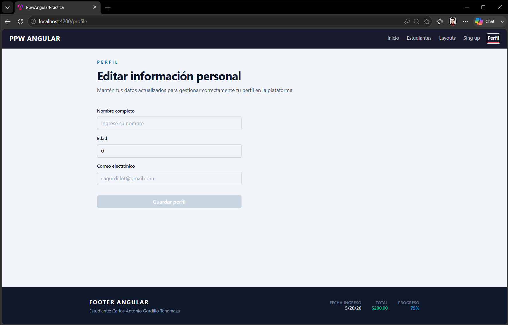
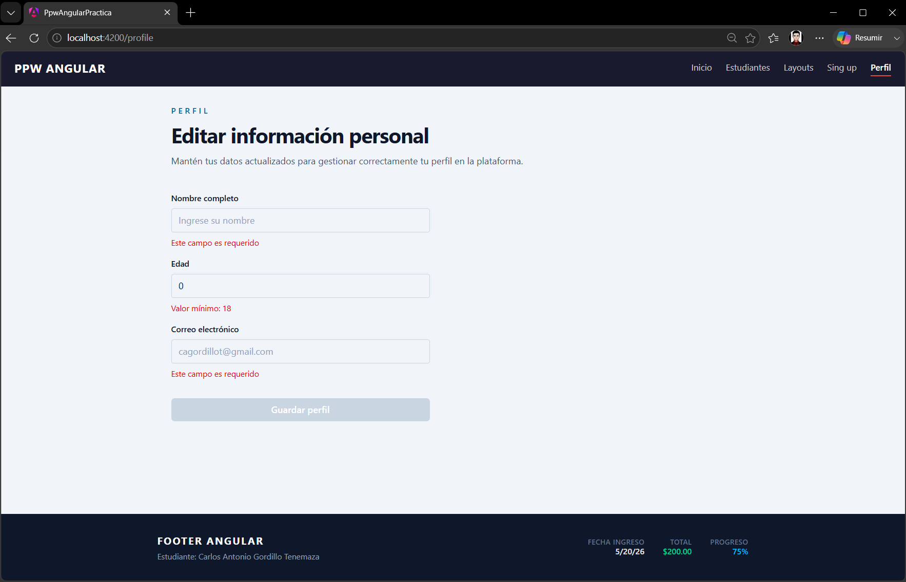
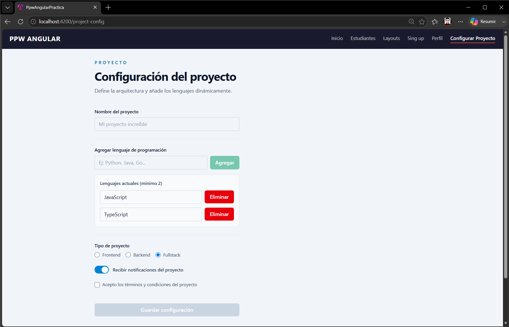
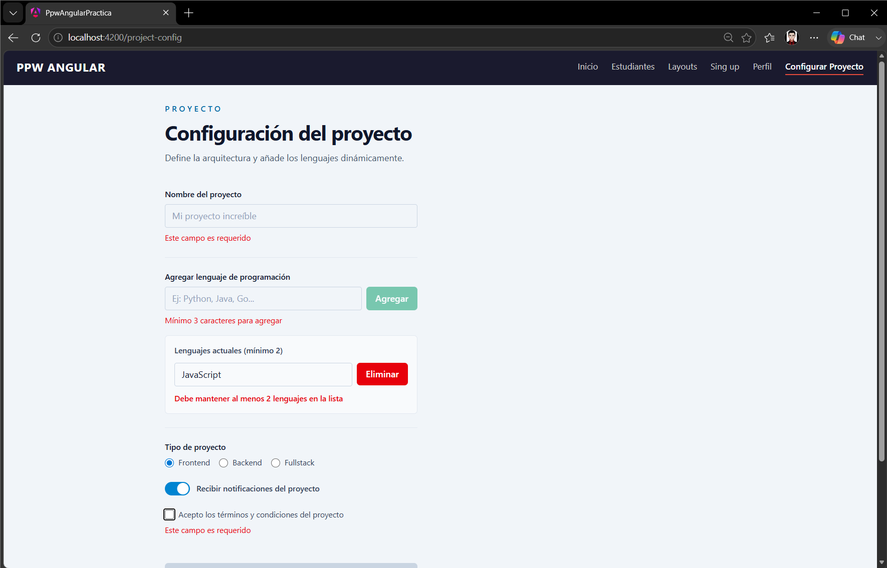
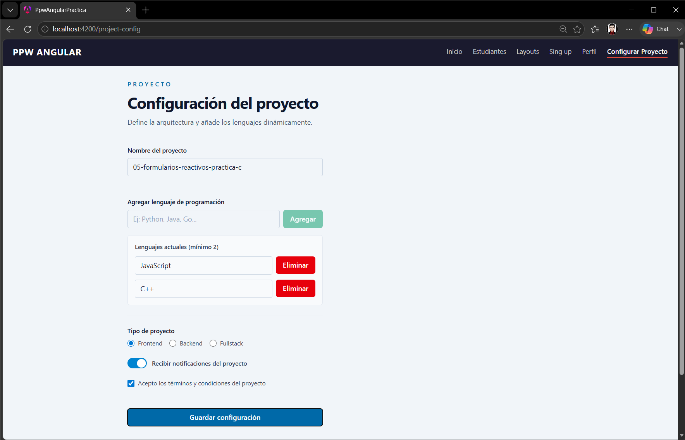
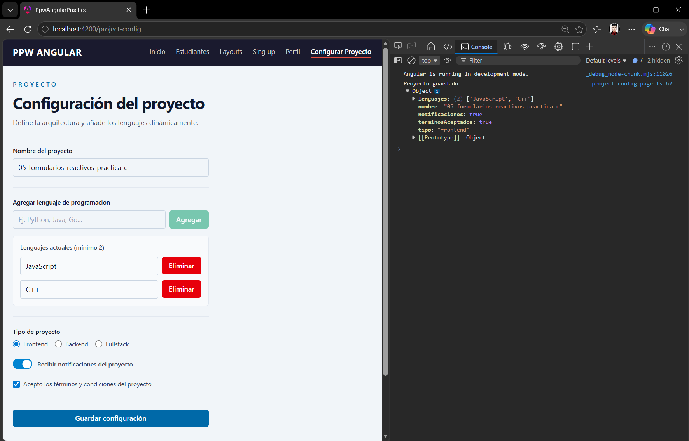

# Práctica 05: Formularios Reactivos Avanzados en Angular

## 📌 Información General

- **Título:** Formularios Reactivos (A, B y C)
- **Asignatura:** Programación y Plataformas Web
- **Carrera:** Ingeniería en Computación
- **Estudiante:** Carlos Antonio Gordillo Tenemaza
- **Semestre:** 5to Semestre
---

## 🛠️ Descripción

Este proyecto aborda el diseño y construcción de formularios reactivos avanzados y dinámicos utilizando **Angular 21**. Se divide en tres fases incrementales para demostrar las mejores prácticas en el manejo de datos, validaciones e interfaces de usuario:

* Fase A (Sign up): Implementación de validadores personalizados cruzados (verificación de contraseñas) y validadores asíncronos simulando consultas a una base de datos mediante operadores de RxJS (`of, delay, map`).

* Fase B (Perfil): Aplicación del principio DRY mediante la refactorización del código repetitivo. Se desarrolló una clase utilitaria centralizada (`FormUtils`) para abstraer la lógica de validación y la traducción dinámica de códigos de error a mensajes legibles.

* Fase C (Configuración de Proyecto): Creación de un formulario complejo que integra FormArray para la inserción y eliminación dinámica de elementos (lenguajes de programación), además de la gestión de controles especiales de interfaz como botones de radio, switches booleanos y checkboxes de aceptación obligatoria.

---

## 💻 Fragmentos de Código Destacado

### 1. Validador Asíncrono con RxJS (Fase A)
```typeScript
export function emailUniqueValidator(): AsyncValidatorFn {
  return (control: AbstractControl): Observable<ValidationErrors | null> => {
    const correosTomados = ['test@test.com', 'admin@admin.com', 'cagordillot@email.com'];
    return of(control.value).pipe(
      delay(500), 
      map((email: string) => {
        return correosTomados.includes(email) ? { emailTaken: true } : null;
      })
    );
  };
}
```

### 2. Centralización de Errores con Helper Class (Fase B)
```typeScript
static getFieldError(form: FormGroup, fieldName: string): string | null {
    const control = form.controls[fieldName];
    if (!control) return null;

    const errors = control.errors ?? {};
    return FormUtils.getTextError(errors);
  }
```

### 3. Inserción Dinámica en FormArray (Fase C)
```typeScript
onAddLenguaje() {
    if (this.newLenguaje.invalid) return;
    
    this.lenguajes.push(
      this.fb.control(this.newLenguaje.value, [
        Validators.required,
        Validators.minLength(3)
      ])
    );
    this.newLenguaje.reset();
  }
```

---

## 🧑‍💻 Capturas de Pantalla Parte A (Sign up)

### 1. Formulario con todos los errores activos
**Descripción:** Comprobación del estado INVALID general del formulario. Se muestran las validaciones síncronas estándar (required, minlength) interactuando simultáneamente con el validador cruzado (passwordMismatch).




### 2. Validador asíncrono en ejecución
**Descripción:** Captura del input de correo reaccionando a un correo simulado como "ya registrado". Demuestra la transición del estado PENDING al error emailTaken evaluado mediante latencia simulada.




## 🧑‍💻 Capturas de Pantalla Parte B (Perfil y FormUtils)

### 3. Formulario vacío en estado inicial
**Descripción:** Renderizado inicial de la vista de Perfil. Muestra una interfaz limpia y simétrica donde el botón de "Guardar perfil" se encuentra correctamente bloqueado por el estado inválido del formulario.



### 4. Errores renderizados por FormUtils
**Descripción:** El formulario intercepta la función submit con campos inválidos y ejecuta markAllAsTouched(). Todos los mensajes en pantalla son proveídos dinámicamente por la clase utilitaria FormUtils.



## 🧑‍💻 Capturas de Pantalla Parte C (Formulario Dinámico)

### 5. Configuración de proyecto - Estado inicial
**Descripción:** Vista inicial del formulario complejo. Se evidencia el control independiente para agregar lenguajes y el renderizado por defecto del FormArray con "JavaScript" y "TypeScript" inicializados.



### 6. Controles especiales y validación dinámica
**Descripción:** Ejecución de errores complejos. Se muestra el requerimiento de selección de Radio Buttons, el error de validación de checkbox obligatorio (requiredTrue) y la alerta dinámica de longitud mínima cuando el FormArray posee menos de dos lenguajes.



### 7. Formulario válido y completo
**Descripción:** Estado satisfactorio del formulario interactivo. Array dinámico poblado correctamente, checkbox aceptado y campos de texto validados, provocando la habilitación del botón de envío final.



### 8. Salida de datos serializados (Consola)
**Descripción:** Captura de la consola del navegador demostrando la extracción de los datos. Se comprueba que los valores estáticos, el FormArray y los booleanos (del switch y checkbox) se consolidan correctamente en un solo objeto JSON listo para una API.



